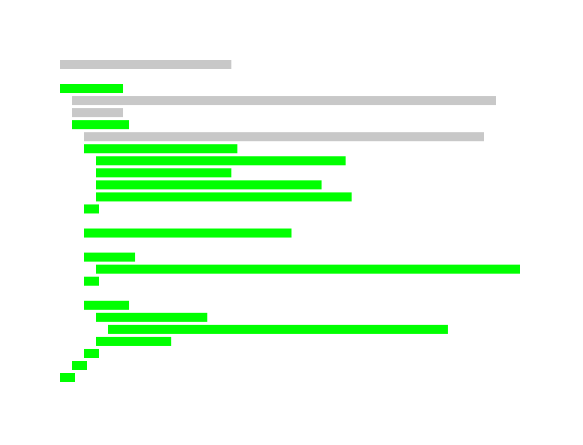

# Of-If

Generate images of Ruby source code that focus on identation. Discuss on the
style and find heavy blocks with ease.



## Usage

```sh
# install the gem
$ gem install of_if
# run in your project directory, creates a new dir: ./of_if/
$ of-if
$ ls of_if/
  lib_version.png lib_mygem_application.rb
```

## Development

```sh
$ bundle install
$ bundle exec rake specs
```

## So, why the name?

Indentation often comes with conditional statements and branching of code,
splitting the thoughts of a reader.

"of" is a pre-position :rofl: - it also indicates a relation
to something, e.g. distance "of", direction (south of), etc.

## License

The gem is available as open source under the terms of the [MIT
License](https://opensource.org/licenses/MIT).
